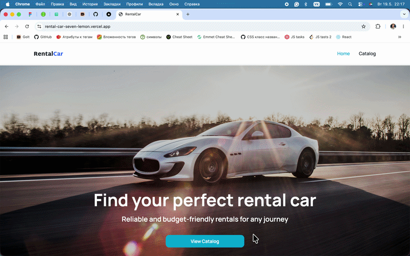

# Rental Car 🚘

This is a car rental web application where users can browse a catalog of available cars for rent.
The app includes filtering and pagination features for convenient navigation through the catalog.

Users can also view detailed information about each car on a separate page, including
specifications, rental conditions, and a booking form for submitting a rental request.

## Demo

https://rental-car-seven-lemon.vercel.app/



## Features

- Browse a catalog of available rental cars
- Filter cars by brand, rental price, and mileage
- Infinite scroll with “Load more” functionality
- View detailed information for each car on a separate page
- Submit a rental request through the booking form
- Real-time form validation and toast notifications
- Loading and error state handling
- SEO optimization with metadata and Open Graph tags
- Dynamic routing for car detail pages

## Tech Stack

### Frontend

- Next.js
- React
- TypeScript

### State Management & Data Fetching

- TanStack Query
- Axios

### Forms & Validation

- Formik
- Yup

### UI & Styling

- CSS Modules
- React Select
- React Hot Toast

### Code Quality

- ESLint
- Prettier

### Deployment

- Vercel

## Installation

Clone the repository:

```bash
git clone git@github.com:ViktoriiaBieliaieva/rental-car.git
```

Navigate to the project folder:

```bash
cd <project-folder>
```

Install dependencies:

```bash
npm install
```

## Run Locally

Start the development server:

```bash
npm run dev
```

Open the application in your browser:

```bash
http://localhost:3000
```

## Authors

- [@ViktoriiaBieliaieva](https://github.com/ViktoriiaBieliaieva)
